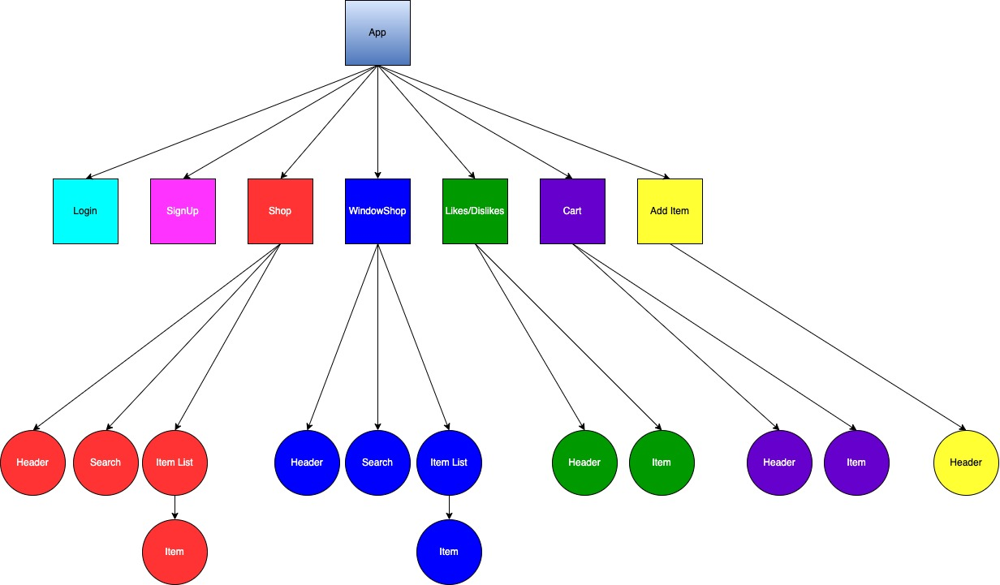

# Window Shopper
Phase 2 Project

## Introduction
Window Shopper is a shopping app that allows users to view/like/dislike items, add items to cart, search/filter items, and list items to sell.

## Repo
* GitHub Repository: https://github.com/jawndrade/window-shopper

## Technologies
* React
* JavaScript
* HTML
* CSS
* JSON  
* Bootstrap
* NPM Spotify Embed

## User Stories
The user can:
* Login to an existing account
* Sign up and create an account
* View all items
* View one item at a time via the window shop
* Like or dislike items
* Add items to their cart
* Remove items from cart
* Search for an item
* Filter items by category
* Add items to sell
* Toggle between light and dark mode

## Setup
To run this project, follow the following steps:
1. Clone [repository](https://github.com/jawndrade/window-shopper)
```
git clone https://github.com/jawndrade/window-shopper
```
2. Get the server running
```
cd window-shopper
```
```
json-server --watch db.json
```
3. Install packages and start the app
```
npm i && npm start
```

## Component Tree


## Demo
### Login & Sign up & Dark Mode


### Shop & Window Shop Pages: Search, Filter, Toggle, View Description


### Likes / Dislikes & Cart


### List an Item


## Features
### Backend API Points
METHOD | ENDPOINT | DESCRIPTION
------ | ---------| -----------
GET | /items | fetches a list of items and their data from the database
POST | /items | keeps a new item from "list item" form
GET | /users | fetches a list of users
POST | /users | keeps a new user from sign up page

### Client-Side Routes
ROUTE | DESCRIPTION
---------| -----------
/ | home page + login page
/signup | sign up page
/shop | view all items
/windowshop | view one item at a time
/additem | list a new item
/cart | view your cart
/likes | view your likes and dislikes

## Stretch Goals
* Swipe functionality in window shop mode
* Chat box for help and questions
* Order functionality
* Edit and/or delete your account